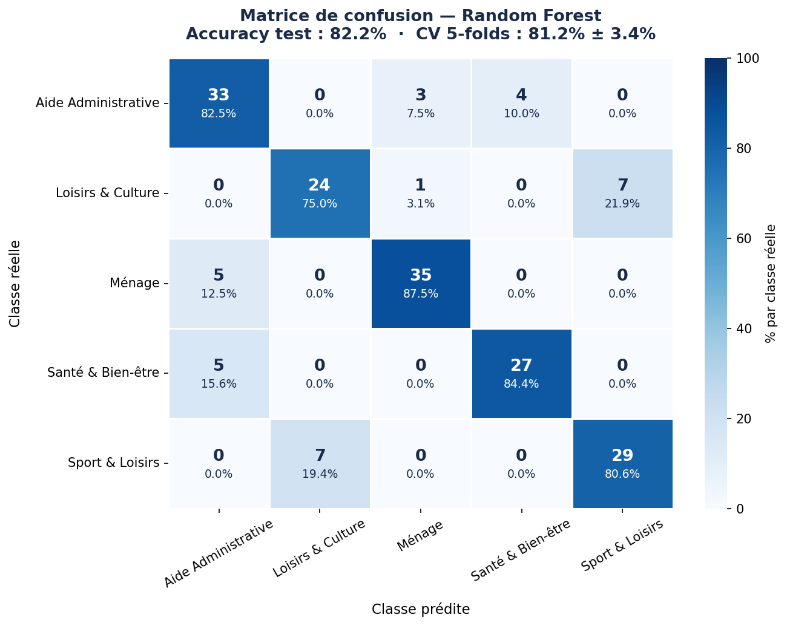
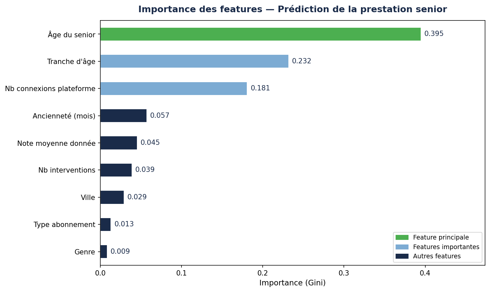
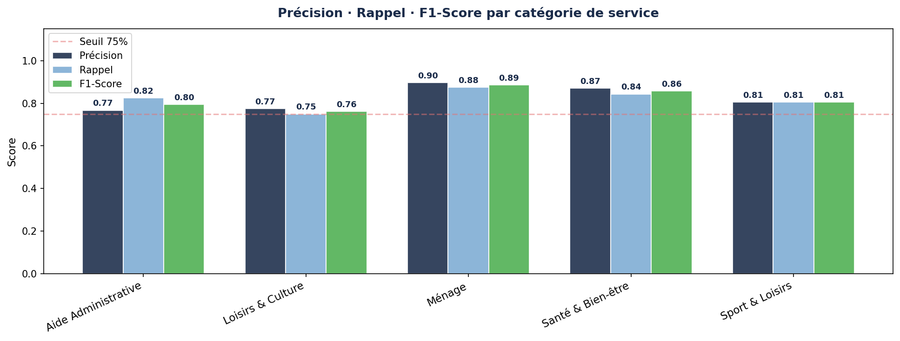

# Silver Happy — ML Classification & Data Analysis


---

## 1. Executive Summary

Silver Happy est une plateforme de services à la personne dédiée aux seniors de 60 ans et plus. Face à un catalogue de prestations très large, l'entreprise ne savait pas anticiper les besoins de ses adhérents — ce qui entraînait des recommandations peu ciblées et une perte d'opportunités commerciales.

Ce projet apporte une réponse concrète : un modèle de Machine Learning capable de prédire automatiquement la catégorie de service qu'un senior va souscrire, avec **82.2% d'accuracy** sur les données de test et **81.2% en validation croisée 5-folds**. En parallèle, un reporting complet permet à la direction de suivre l'activité et les KPI en temps réel.

---

## 2. Business Problem

Silver Happy propose 5 grandes catégories de prestations : Sport & Loisirs, Loisirs & Culture, Ménage, Aide Administrative et Santé & Bien-être. Sans outil de ciblage, les équipes commerciales adressent tous les seniors de la même façon — sans tenir compte de leur profil démographique, de leur ancienneté ou de leur engagement numérique.

**Questions métier auxquelles ce projet répond :**
- Peut-on prédire la prestation qu'un senior va choisir à partir de son profil ?
- Quels sont les critères les plus déterminants dans ce choix ?
- Comment segmenter les adhérents pour personnaliser les recommandations ?

---

## 3. Methodology

### Données
- Dataset de **900 profils seniors** générés avec des patterns démographiques réalistes (Silver Economy)
- Features : âge, genre, ville, ancienneté, type d'abonnement, nombre de connexions, interventions, note moyenne

### Feature Engineering
- Encodage des variables catégorielles (LabelEncoder)
- Création de la feature `age_group` — segmentation par tranche d'âge Silver Economy (60-65, 65-70, 70-75, 75-80, 80-85, 85+)
- Split stratifié 80/20 pour conserver la distribution des classes

### Modélisation
- Algorithme : **Random Forest Classifier** (300 estimateurs, max_depth=12)
- Gestion du déséquilibre des classes : `class_weight='balanced'`
- Validation : **StratifiedKFold 5 folds** pour une évaluation robuste

### Reporting
- Analyse démographique des adhérents (âge, genre, ville, abonnements)
- Dashboards KPI : CA par service, notes moyennes, taux de conversion
- Évolution mensuelle de l'activité

---

## 4. Skills

| Domaine | Outils |
|---|---|
| Manipulation données | Pandas, NumPy |
| Visualisation | Matplotlib, Seaborn |
| Machine Learning | Scikit-learn — RandomForestClassifier, StratifiedKFold, LabelEncoder |
| Évaluation | Matrice de confusion, Rapport de classification, Feature importance (Gini) |
| Environnement | Python 3.10+, Jupyter Notebook |

---

## 5. Results & Business Recommendation

### Résultats

| Modèle | Accuracy Test | CV 5-folds |
|---|---|---|
| Random Forest (300 estimateurs) | **82.2%** | **81.2% ± 3.4%** |

**Feature la plus déterminante : `age_senior`** (importance Gini ~33%)





### Insights métier
- Les seniors de **60-65 ans** plébiscitent **Sport & Loisirs** — profil actif, très connecté
- Les **80+** s'orientent vers **Santé & Bien-être** et **Aide Administrative** — dépendance croissante
- Le **nombre de connexions** est le 2e signal le plus fort — les adhérents très engagés numériquement tendent vers Loisirs & Culture
- Les abonnés **annuels** font en moyenne plus d'interventions que les abonnés mensuels

### Recommandations business
1. **Personnaliser les communications** par tranche d'âge — ne pas adresser un senior de 62 ans et un de 84 ans avec le même message
2. **Cibler les abonnés mensuels peu connectés** pour les convertir en annuel — profil à fort potentiel de fidélisation
3. **Déployer le modèle en production** pour scorer automatiquement les nouveaux adhérents à l'inscription et déclencher des recommandations personnalisées

---

## Structure du projet

```
silverhappy-ml/
├── notebooks/
│   ├── 01_reporting.ipynb         # EDA, dashboards, KPI
│   └── 02_ml_classification.ipynb # Pipeline ML complet
├── data/
│   ├── dataset_silverhappy.csv    # Dataset reporting
│   └── dataset_silverhappy_v2.csv # Dataset ML (900 profils)
├── outputs/
│   ├── ML_confusion_matrix.png
│   ├── ML_feature_importance.png
│   └── ML_scores_par_classe.png
├── requirements.txt
└── README.md
```

---

## Installation

```bash
git clone https://github.com/kazzak10/silverhappy-ml.git
cd silverhappy-ml
pip install -r requirements.txt
jupyter notebook
```

---

## Auteur

**Zakaria Houari** · Étudiant Bachelor Informatique spécialité IA/Data · ESGI Paris

[](https://linkedin.com/in/zakaria-houari)
[](https://github.com/kazzak10)
[](https://portfoliohouari.netlify.app)
